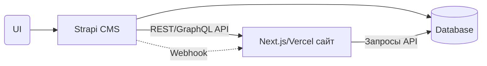
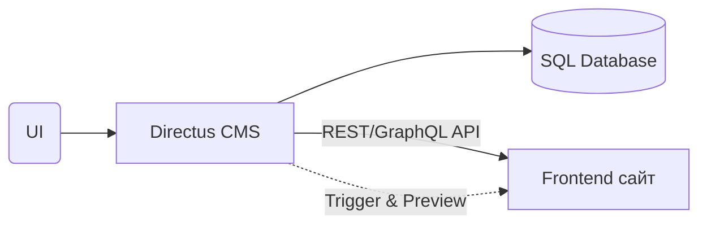
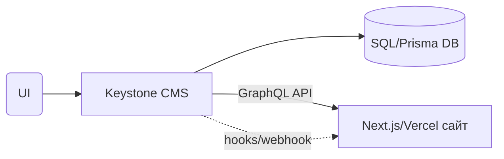

# Opus 4.7

````md
# Replacing Keystatic with a Hosted Headless CMS for a Next.js 15 Trilingual Portfolio

## Executive summary — the short answer

**Use Sanity.** It is the only mainstream hosted headless CMS whose **free** tier supports three locales (RU/EN/DE)
without restriction, has a first‑class Next.js 15 App Router SDK with on‑demand `revalidateTag()` from webhooks (
eliminating GitHub Actions + Vercel rebuilds), keeps editors out of the way with a polished, customisable Studio, and
lets you keep your Cloudflare R2 setup essentially untouched. Every other "obvious" candidate — Hygraph, Storyblok,
Prismic, Contentful — caps the free tier at **2 locales**, which immediately disqualifies a RU/EN/DE site unless Roma's
portfolio jumps to a paid plan starting at $10–$300/month. DatoCMS is a close second on developer experience and image
handling, but its 300‑record / 200 MB asset ceiling will bite a director who posts photo‑heavy production galleries.
Strapi Cloud's new free tier (Dec 2025) is now too small (2,500 API requests/month) and Directus Cloud retired its
Starter tier in November 2025; Payload Cloud has no free hosted plan.

The recommended stack: **Sanity Free plan + Sanity Studio embedded at `/studio` + GROQ‑Powered
Webhooks → `/api/revalidate` route that calls `revalidateTag()` → Next.js 15 RSC pages that cache by tag.** Roma's edits
go live in 1–3 seconds; no GitHub Action runs, no Vercel rebuild fires, and your R2 + sharp + @vercel/og pipeline stays
intact (Sanity's CDN handles editor uploads; R2 keeps everything else).

---

## How the free tiers actually look in 2025–2026

The single most decisive constraint for this project is **how many locales the free plan allows**. The breakdown below
is current as of the May 2026 pricing pages.

| CMS                                  | Free locales                                           | Other key free limits                                                                                                        | First paid step                                           | Verdict for RU/EN/DE                       |
| ------------------------------------ | ------------------------------------------------------ | ---------------------------------------------------------------------------------------------------------------------------- | --------------------------------------------------------- | ------------------------------------------ |
| **Sanity Free**                      | **Unlimited** (locales are schema fields, not metered) | 20 users, 10,000 documents, 1M CDN API calls, 1M API requests, 100 GB assets, 100 GB bandwidth, 2 datasets                   | Growth $15/seat/mo (admins)                               | **✅ Fits cleanly**                        |
| **DatoCMS Free**                     | 1 included; additional locales are paid add‑ons        | 2 editors, 300 records, 100k API calls, 10 GB bandwidth, 200 MB asset storage, 3 projects                                    | Professional €149/mo (annual) or €199/mo                  | ⚠ Records and asset cap will bite         |
| **Hygraph Hobby**                    | **2 locales** (hard cap)                               | 3 users, 1,000 entries, generous API calls                                                                                   | Growth ~$199/mo (3 locales)                               | ❌ Blocks RU/EN/DE                         |
| **Storyblok Starter**                | **2 locales** (no overage allowed)                     | 1 user (max 2), 100 GB traffic, 100k API requests, 25k AI credits                                                            | Growth €99/mo (still only 2–4 locales + paid extras)      | ❌ Blocks RU/EN/DE                         |
| **Prismic Free**                     | **2 locales** (recently reduced)                       | 1 user, unlimited documents/types/assets, Visual Page Builder                                                                | Starter $10/mo = 3 locales                                | ⚠ Free blocks RU/EN/DE; $10/mo unlocks    |
| **Contentful Free**                  | Typically **2 locales**, 25 content models             | 50 GB bandwidth/mo, 100k API calls/mo, 5 users; **explicitly forbidden for commercial use** per Contentful's Free plan terms | Lite **$300/mo** (and reportedly often $850/mo effective) | ❌ TOS + locale + cliff                    |
| **Strapi Cloud Free** (new Dec 2025) | Unlimited (Strapi i18n plugin)                         | **2,500 API requests/mo**, 10 GB storage, 10 GB bandwidth, 1 production env, 1 collaborator                                  | Essential $15–$18/mo                                      | ❌ 2,500 req/mo is too low for a live site |
| **Directus Cloud**                   | n/a — **Starter Cloud retired Nov 2025**               | No free hosted tier remains; only self‑hosting is free under BSL                                                             | Professional Cloud (paid)                                 | ❌ No hosted free tier                     |
| **Payload Cloud**                    | n/a                                                    | No free hosted tier; Payload itself is MIT but Cloud starts at $35/mo Standard                                               | Standard $35/mo                                           | ❌ No hosted free tier                     |
| **TinaCMS**                          | Free tier exists                                       | Git‑backed — content lives in your repo and edits trigger commits                                                            | —                                                         | ❌ Doesn't solve the rebuild problem       |
| **Builder.io**                       | Free tier exists                                       | Visual‑builder–first; awkward for long‑form bilingual editorial                                                              | Growth tier paid                                          | ⚠ Possible but wrong shape                |

---

## Detailed evaluations (10 criteria per viable candidate)

### 1. Sanity — recommended winner

1. **Free‑tier limits (per project; unlimited free projects allowed):** 20 user seats, 2 public datasets, 10,000
   documents (drafts count), 1,000,000 CDN API requests/mo, 1,000,000 direct API requests/mo, 100 GB asset storage, 100
   GB bandwidth/mo. Hard cap, no overages — exceeding blocks writes until the cycle resets. Two roles only (
   Administrator and Viewer; Editor/Developer/Contributor come with Growth).
2. **i18n.** Sanity explicitly does not meter locales — they are just fields. Two community patterns: **field‑level** (
   one document with `title.ru`, `title.en`, `title.de`) via `@sanity/document-internationalization` +
   `@sanity/language-filter`, or **document‑level** (one doc per locale). For Roma's site, field‑level is the better
   mirror of next-intl's keying. No commercial restriction on free.
3. **Next.js 15 App Router integration.** Best in class. Official `next-sanity` package ships `sanityFetch` with
   built‑in `next: { tags }` caching, App Router Visual Editing, `defineLive` for streaming preview, and `parseBody` for
   webhook validation. Full RSC support; Studio itself runs as a Next.js route at `/studio`.
4. **Content propagation.** Publish → GROQ‑Powered Webhook (filtered to the document types you care about) → your
   `/api/revalidate/route.ts` validates signature → `revalidateTag(body._type)` from `next/cache` → Next.js evicts the
   matching fetch caches → next visitor renders fresh. Typical end‑to‑end latency: **1–3 seconds, no rebuild**. One
   papercut: `revalidateTag` only invalidates a cached fetch when the path is next visited, and
   sanity-io/next-sanity#639 documents flaky behaviour on some dynamic segments — mitigated by tagging fetches with both
   a type tag and a slug‑specific tag, and falling back to `revalidatePath('/', 'layout')` for global documents.
5. **Image handling.** Sanity ships its own CDN (`cdn.sanity.io`) with on‑the‑fly transforms, hotspots, automatic LQIP (
   `asset.metadata.lqip`) and WebP/AVIF. Two integration options: (a) keep R2 for everything and use a string field to
   hold R2 URLs (custom Studio input component uploads to your existing R2 endpoint), or (b) let Roma drag‑and‑drop into
   Studio and use Sanity's CDN, retiring the sharp LQIP build step. Option (b) is recommended for the editor UX win.
6. **Admin UI for Roma.** Sanity Studio is a customisable React SPA mounted at `/studio`. Real‑time collaborative
   editing, per‑document preview pane, drafts, references, structured Portable Text editor, presence indicators.
   Defaults are clean; minor customisation pins down the labels Roma will see. Studio chrome is English only; field
   labels and help text you author can be in any language (Russian field labels work fine). Cyrillic content has no
   issues — Studio uses standard Unicode inputs.
7. **Schema definition.** Code‑first, TypeScript, schema‑as‑code in `sanity.config.ts`. Your existing Keystatic schema
   translates almost mechanically. Dan will be happy.
8. **Pricing escalation.** Free → Growth
   at $15 per occupied seat per month (Viewers are free; Roma + Dan as Administrators = $30/mo). Growth adds scheduled
   publishing, Editor/Developer/Contributor roles, comments, tasks, and raises the document cap to 25,000. An Increased
   Quota add‑on ($299/mo) extends to 50,000 docs. Enterprise is custom (~$5–10K/mo per a 2023 Sanity reference, likely
   higher now).
9. **Pros & cons for this use case.** Pros: free tier is genuinely usable in production, locales free, Next.js 15
   integration excellent, schema‑as‑code keeps Dan productive, Studio looks professional to Roma, can keep R2 or migrate
   to Sanity CDN, no commercial‑use restriction. Cons: no scheduled publishing on free; only 2 roles on free (both Roma
   and Dan are Administrators — fine for two people); GROQ has a learning curve for Dan; Studio is mildly overkill for a
   single‑editor portfolio.
10. **Known limitations.** No first‑party Russian admin UI translation (English chrome only — universally true across
    this comparison set). No issues running on Vercel (Sanity is platform‑agnostic and Vercel publishes a Sanity
    quickstart). RTL not relevant (RU/EN/DE are all LTR). Cyrillic content is fine. Watch the `revalidateTag`
    dynamic‑segment caveat above.

### 2. DatoCMS — strong runner‑up, blocked by record/asset limits

1. **Free tier:** 3 projects, **2 editors**, **300 records total**, 100k Content Delivery API calls/mo, 10 GB
   bandwidth/mo, 120 min video streaming, **200 MB asset storage**, 3 days of history retention. Hard caps, no overages.
   Importantly, _blocks_ (content embedded inside Modular Content fields) do **not** count against the records limit — a
   key schema design tip Dan should use to stretch the cap.
2. **i18n.** Field‑level localisation with strict API guarantees (you must supply the full locale set on updates so
   translations can't be accidentally dropped). The free plan ships with 1 locale; additional locales are paid add‑ons
   even on Free, so RU/EN/DE typically requires Professional. A bundled Yandex Translate plugin can auto‑translate
   Russian fields — relevant for Roma.
3. **Next.js 15 integration.** Excellent. Official `react-datocms` package, GraphQL with typed auto‑generated queries,
   Real‑time Updates API for live preview, full App Router and RSC support.
4. **Content propagation.** Standard webhooks → `revalidateTag` / `revalidatePath` pattern in `/api/revalidate`. No
   rebuild required. Real‑time Updates API can additionally stream changes to clients without revalidation if you want
   truly live‑updating pages.
5. **Image handling.** Best‑in‑class — every uploaded asset auto‑served from Imgix with on‑the‑fly resize, WebP/AVIF,
   focal‑point cropping, smart cropping, blur‑up LQIP. You could entirely retire sharp's LQIP generation. R2 can still
   be used for non‑CMS assets, but free‑plan 200 MB Dato storage is a real ceiling for a photo‑heavy theatre site.
6. **Admin UI.** Polished, marketer‑friendly, popup image editor with focal point/metadata, collapsible fieldsets,
   white‑labelled admin, presence indicator for collaborative editing, GraphiQL playground built in. Great for Roma.
   Studio is in English; Cyrillic content fine.
7. **Schema definition.** UI‑based visual content modelling with a Content Management API; less code‑first than Sanity
   but more visual. Migration scripts are straightforward via the CMA client.
8. **Pricing escalation.** Free → Professional €149/mo (annual) / €199/mo (monthly) — a sharp jump. 50% off for
   non‑profits and educators; 30% for agency Partner Program members. Enterprise is custom.
9. **Pros & cons.** Pros: image pipeline is unrivalled, polished editor UI, predictable structured editing, real‑time
   preview. Cons: 300‑record cap and 200 MB asset cap on free are restrictive for a photo‑heavy theatre portfolio with
   multiple productions; locales are paid add‑ons; first paid tier is steep at €149/mo.
10. **Known limitations.** Hosted in EU data centres (Ireland) — fine for a German/Russian/English audience but may
    matter for GDPR documentation. No Russian admin UI. Cyrillic content fine. Works perfectly on Vercel.

### 3. Hygraph — disqualified by 2‑locale Hobby cap

1. **Free Hobby:** 3 users, ~1,000 entries, unlimited asset storage on some quota tracks, generous API calls, content
   stages, live preview. No credit card required.
2. **i18n.** Field‑level localisation, fallback logic per locale, locale‑specific publishing — and on paid tiers,
   unlimited locales. **Hobby is hard‑capped at 2 locales.** Growth at ~$199/mo unlocks 3 locales.
3. **Next.js 15 integration.** GraphQL‑native with strong typed queries; webhooks → `revalidateTag` pattern works as
   expected.
4. **Content propagation.** Standard webhook on publish → revalidate. No rebuild.
5. **Image handling.** Built‑in DAM with CDN delivery; can mirror to external storage via webhooks if needed.
6. **Admin UI.** Clean, intuitive, GraphQL playground built in. Editors generally like it.
7. **Schema.** UI schema builder with management API. Auto‑generates typed GraphQL queries Dan can use directly.
8. **Pricing escalation.** Hobby → Growth $199/mo is the cliff that bites here. No middle step.
9. **Pros & cons.** Pros: clean UI, generous entries, Content Federation is unique. Cons: **2‑locale hard cap** is fatal
   for RU/EN/DE on free, and the $199/mo Growth jump is enormous for a single‑editor portfolio.
10. **Known limitations.** No Russian admin UI. Cyrillic content fine. Works on Vercel without issue.

### 4. Storyblok — disqualified by 2‑locale Starter cap and 1‑user limit

1. **Starter (free, no credit card):** 1 included user (max 2 with paid seat), 100 GB traffic, 100k API requests, **2
   locales** (no purchase to add more), 25k AI credits.
2. **i18n.** Locale management at folder or field level; visual editor switches locale inline. But Storyblok's PLG
   strategy explicitly uses locales to force upgrades — 2 on Starter, 4 on Growth (€99/mo), 10 on Growth Plus (€349/mo).
3. **Next.js 15 integration.** Official `@storyblok/react` SDK with App Router support, Visual Editor bridge for
   in‑context editing.
4. **Content propagation.** Webhooks → revalidate, plus a Draft API for live preview. No rebuild required.
5. **Image handling.** Built‑in Storyblok Image Service with on‑the‑fly transforms, focal points, format conversion,
   global CDN cache. Can still use R2 for non‑CMS assets.
6. **Admin UI.** **The best WYSIWYG editor experience in the comparison set** — Roma can click on a paragraph in a live
   preview and edit it directly. If 2 locales were sufficient this would be a top contender.
7. **Schema.** Block‑based components defined either in the UI or via the management API; nestable blocks. Slightly less
   developer‑centric than Sanity/Payload.
8. **Pricing escalation.** Starter (free) → Growth €99/mo → Growth Plus €349/mo. Recent pricing changes added overage
   charges and locale add‑ons (€20 per extra locale). Reddit reports of legacy customers being auto‑moved into higher
   tiers exist.
9. **Pros & cons.** Pros: best visual editor for Roma, generous traffic/API on free, polished. Cons: **2‑locale cap and
   1‑user cap on free**; jumping to €99–€349/mo is excessive for a theatre portfolio.
10. **Known limitations.** SaaS‑only (no self‑host), public Content Delivery API requires a region selector that can
    confuse first‑time setup, Visual Editor relies on `localStorage` and breaks in private browsing. No Russian admin
    UI. Cyrillic content fine.

### 5. Prismic — disqualified on free, viable at $10/mo

1. **Free:** 1 user, **2 locales**, unlimited documents, unlimited types, unlimited assets, Visual Page Builder
   included, image optimization. Locale limit recently reduced from previous "unlimited".
2. **i18n.** Locale toggle on each page; supports independent publishing per locale.
3. **Next.js 15 integration.** Strong — Slice Machine generates TypeScript types directly into your repo, official
   `@prismicio/next` package with App Router support, `revalidateTag`/`revalidatePath` patterns work cleanly.
4. **Content propagation.** Webhooks on publish → revalidate. No rebuild.
5. **Image handling.** Built‑in Imgix‑backed image optimization with on‑the‑fly transforms.
6. **Admin UI.** Visual Page Builder is editor‑friendly; Slice‑based composition appeals to Dan.
7. **Schema.** Slice Machine — code‑first slice definitions in your repo, synced to Prismic. Excellent DX for Dan,
   possibly more structure than Roma needs.
8. **Pricing escalation.** Free → Starter $10/mo (3 locales, 3 users) → Small $25/mo (4 locales, 7 users) →
   Medium $150/mo (5 locales, 25 users) → Platinum $675/mo (8 locales). **Starter at $10/mo is the cheapest paid path to
   RU/EN/DE in this comparison.**
9. **Pros & cons.** Pros: Slice Machine is genuinely lovely DX, Starter at $10/mo is cheap, all the right Next.js
   plumbing. Cons: free tier blocks 3 locales; user reports of aggressive auto‑upgrade behaviour when limits exceeded (
   community.prismic.io threads about 100–2000% price jumps); rich‑text editor lacks blockquotes and relative links.
10. **Known limitations.** Auto‑upgrade can surprise — disable it in Spend Manager and set hard limits. No Russian admin
    UI. Cyrillic content fine. Works on Vercel.

### 6. Contentful — disqualified outright

1. **Free (as of April 30, 2025):** 50 GB bandwidth/mo, 100k API calls/mo, 25 content models, 5 users.
2. **i18n.** Typically 2 locales on free; locale‑based publishing and localized workflows live behind paid Premium
   tiers. Reddit users widely report locale costs forcing tier upgrades.
3. **Next.js 15 integration.** Mature but verbose SDK; on‑demand revalidation works.
4. **Content propagation.** Webhooks → revalidate. No rebuild.
5. **Image handling.** Built‑in image CDN with transforms.
6. **Admin UI.** Polished, role‑customizable, used by many enterprises.
7. **Schema.** UI‑based content type editor with management API.
8. **Pricing escalation.** Free → Lite **$300/mo** (sources cite effective $850/mo). No gradual middle step.
9. **Pros & cons.** Cons dominate for this use case: **Contentful's Free plan TOS explicitly limits use to "personal
   projects, hack weeks or supporting a local non‑profit … not intended for commercial purposes."** A theatre director's
   professional portfolio is commercial — using the free tier violates terms. The $300/mo entry point is wildly
   disproportionate to the project.
10. **Known limitations.** Commercial‑use restriction on free is the killer. No Russian admin UI. Cyrillic fine. Works
    on Vercel.

### 7. Strapi Cloud — disqualified by new Dec 2025 free limits

1. **Free (new Dec 22, 2025 limits for new signups):** **2,500 API requests/mo**, 10 GB storage, 10 GB bandwidth, 1
   production environment, 1 collaborator, no credit card. (Existing Essential customers keep 100,000 API requests.)
   2,500/mo ≈ 80/day — likely exhausted by your own previewing.
2. **i18n.** Strapi's i18n plugin supports unlimited locales — would be perfect functionally if the API budget were
   larger.
3. **Next.js 15 integration.** REST + GraphQL; community examples for App Router revalidation are well established but
   not as polished as Sanity's first‑party SDK.
4. **Content propagation.** Webhooks → revalidate; functions plugin exists.
5. **Image handling.** Built‑in media library; supports S3/R2 providers natively via the upload provider plugin —
   actually a very clean R2 fit.
6. **Admin UI.** Strapi Admin is solid, customizable, and notably has community Russian translations available — the
   only candidate in this comparison with realistic Russian UI options.
7. **Schema.** UI Content‑Type Builder with code generation; collection definitions live in `src/api/*` as JSON.
8. **Pricing escalation.** Free (2,500 API) → Essential $15/mo annual ($18/mo monthly) with 50,000 API requests → Pro →
   Scale → Growth/Enterprise CMS licenses are separate from hosting.
9. **Pros & cons.** Pros: open source, native R2 upload provider, Russian admin UI via i18n plugins, unlimited locales.
   Cons: free hosted tier is too small for a public site after the Dec 2025 cuts; self‑hosting was excluded by the
   user; $15–$18/mo entry isn't terrible if budget allows.
10. **Known limitations.** Free tier effectively only useful for evaluation. Works on Vercel as a separate backend.
    Russian admin UI possible via community translations.

### 8. Directus Cloud — no free hosted tier (Starter retired Nov 2025)

1. **Free tier:** **Eliminated November 2025.** Directus explicitly retired Starter Cloud, citing infrastructure cost
   and the trend of small projects self‑hosting. Self‑hosting under BSL 1.1 is free for orgs under $5M total finances —
   but user excluded self‑hosting.
2. **i18n.** Directus has solid translations support (field‑level), unlimited locales.
3. **Next.js 15 integration.** REST + GraphQL via `@directus/sdk`; webhooks → revalidate.
4. **Content propagation.** Webhooks supported; flows engine for automation.
5. **Image handling.** Built‑in file storage with S3/R2 driver — clean R2 fit on self‑host.
6. **Admin UI.** "Data Studio" is polished and supports localization including Russian.
7. **Schema.** Database‑first (introspects any SQL database) with management API.
8. **Pricing escalation.** Professional Cloud is paid; Enterprise custom.
9. **Pros & cons.** Pros: data‑first, R2 native, Russian UI available. Cons: no free hosted tier remains.
10. **Known limitations.** Hosted free option no longer exists.

### 9. Payload Cloud — no free hosted tier

1. **Free tier:** No free hosted plan. Payload itself is MIT‑licensed and free to self‑host.
2. **i18n.** Payload Localization is first‑class — field‑level, unlimited locales, code‑first definition.
3. **Next.js 15 integration.** **Best technical fit on paper** — Payload 3 installs _into_ an existing Next.js app's
   `app` directory, runs the admin in the same Next.js server, and uses RSC throughout. No CMS API hop; content is
   queried directly from server components via the local Payload API (no HTTP).
4. **Content propagation.** Since the CMS and frontend share a server, you can `revalidateTag` from afterChange hooks
   immediately — zero webhook latency.
5. **Image handling.** Sharp‑based built‑in image transforms; native S3/R2 upload adapter (`@payloadcms/storage-s3`) —
   best R2 integration in the field. Your existing R2 setup transfers directly.
6. **Admin UI.** Excellent — modern, fast, customizable React components, role‑based access control. Some community
   Russian translation work exists.
7. **Schema.** TypeScript‑first, schema‑as‑code, generates types automatically — best DX in the field for Dan.
8. **Pricing escalation.** Standard Cloud $35/mo → Pro Cloud $199/mo → Enterprise Cloud $833/mo (or custom). Self‑hosted
   on Vercel + Neon Postgres + R2 is roughly free for a small site (within Vercel/Neon free tiers).
9. **Pros & cons.** Pros: native to Next.js 15, R2 first‑class, unlimited locales, TypeScript end‑to‑end. Cons: no free
   hosted plan disqualifies under the user's stated rule. If the user reconsiders the no‑self‑host constraint, Payload 3
   self‑hosted is arguably the strongest answer in the whole field.
10. **Known limitations.** Cloud has no free tier. Self‑hosting on Vercel needs Postgres (Neon free tier works). Works
    perfectly with R2.

### 10. TinaCMS — does not solve the rebuild problem

1. **Free tier:** Exists (Cloud Starter).
2. **i18n.** Locale routing is supported but content lives in your repo.
3. **Next.js 15 integration.** Good — Tina is designed around Next.js.
4. **Content propagation.** **This is the disqualifier.** Tina commits to GitHub on publish, which triggers your GitHub
   Actions and Vercel rebuilds — exactly the pain point the user wants eliminated. Tina's live editing overlay bypasses
   rebuilds only for _preview_; published content still flows through git.
5. **Image handling.** Stored in repo or via cloud media; R2 possible via custom upload.
6. **Admin UI.** Live in‑page editing is editor‑friendly.
7. **Schema.** TypeScript/JSON schema in the repo.
8. **Pricing escalation.** Cloud Starter free → Team paid.
9. **Pros & cons.** Pros: editor‑friendly. Cons: **fundamentally git‑based**, so it's a more polished Keystatic — wrong
   category for this problem.
10. **Known limitations.** Doesn't address the build‑latency complaint.

### 11. Builder.io — technically viable, wrong shape

1. **Free tier:** Real and generous for marketing landing pages.
2. **i18n.** Localization is paid on higher tiers.
3. **Next.js 15 integration.** Official SDK supports App Router and RSC.
4. **Content propagation.** Live via API/SDK; no rebuild required.
5. **Image handling.** Built‑in CDN.
6. **Admin UI.** Visual drag‑and‑drop builder — but optimised for assembling component‑based marketing pages, not
   editing trilingual editorial content with structured production metadata.
7. **Schema.** Component registration plus visual model builder.
8. **Pricing escalation.** Tiered; localization and team features paid.
9. **Pros & cons.** Pros: live publishing. Cons: shape mismatch — not designed for long‑form editorial in three
   languages; structured fields (venue, dates, credits) are awkward.
10. **Known limitations.** No Russian admin UI. Cyrillic fine.

### 12. Craft, Wagtail, Ghost — not competitive

None offer a competitive hosted free tier for trilingual headless usage that beats Sanity. Ghost(Pro) starts paid; Craft
Cloud is paid; Wagtail is essentially self‑hosted (Django). Not worth detailing further.

---

## How content propagation will work with Sanity (the answer to the rebuild question)

The pain point is "every content edit triggers a full rebuild cycle." Here is the architecture that fixes it:

1. **In your Next.js 15 server components**, wrap every Sanity GROQ query in `sanityFetch` with appropriate tags:
   ```ts
   const productions = await sanityFetch({
     query: `*[_type == "production"] | order(date desc)`,
     tags: ['production']
   })
   ```
````

2. **Create `/api/revalidate/route.ts`** that validates Sanity's webhook signature with `parseBody` from
   `next-sanity/webhook` and calls `revalidateTag(body._type)`. For navigation or layout‑level documents also call
   `revalidatePath('/', 'layout')`.
3. **In Sanity Manage, create a GROQ‑Powered Webhook** filtered to `_type in ["production", "page", "siteSettings"]`,
   projected as `{_type, _id, "slug": slug.current}`, triggered on create/update/delete, pointing at
   `https://your-site.vercel.app/api/revalidate` with a shared secret stored in both Sanity and Vercel env vars.
4. **Result:** Roma clicks Publish in Studio → Sanity fires the webhook within ~1 second → your Vercel function calls
   `revalidateTag('production')` → Next.js evicts the cached query → the next visitor sees fresh content. \*
   \*No `git push`, no GitHub Action, no Vercel deployment.\*\* The Vercel build minute counter doesn't move.

For draft preview, use Sanity's Live Content (`defineLive` from `next-sanity`) with Next.js Draft Mode — Roma can see
edits stream into a preview URL in real time before publishing.

---

## Migration from Keystatic (markdown/MDX → Sanity structured content)

The work is real but bounded. Plan on a long afternoon for Dan:

1. **Translate your Keystatic schema to Sanity schema files.** Most field types map 1:1 (`text` → `string`, `select` →
   `string` with `options.list`, `image` → `image`, `array` → `array of {type: 'reference'}`). Localised fields become
   objects with `ru`/`en`/`de` sub‑fields, or use `@sanity/document-internationalization` if you prefer one document per
   locale.
2. **Convert MDX bodies to Portable Text.** Use `@sanity/block-tools` `htmlToBlocks()` after rendering MDX → HTML, or
   `mdast-util-to-portable-text` for a more direct AST conversion. Custom MDX components become Portable Text custom
   block types (`{_type: 'callout', ...}`) and render through `@portabletext/react` in your front‑end. This is the
   largest piece of migration work.
3. **Re‑upload images to either Sanity's CDN or your R2 bucket.** A one‑off Node script reading current `public/` assets
   and pushing to Sanity via `client.assets.upload()` is straightforward. If you keep R2, store the public R2 URL as a
   string field and skip Sanity asset upload.
4. **Move LQIP generation.** If you switch to Sanity assets, `asset.metadata.lqip` is auto‑populated; delete your sharp
   LQIP build step. If you keep R2, keep sharp as is.
5. **Replace `@keystatic/core/reader`** calls in `app/` with Sanity `sanityFetch` calls — typically a few dozen line
   changes scattered across server components.
6. **Replace your `/keystatic` admin route with `/studio`** — `npx sanity@latest init --env=.env.local --bare`, then
   mount `<NextStudio config={config} />` at `app/studio/[[...index]]/page.tsx`. Both Roma and Dan log in via Sanity
   SSO (Google/GitHub).
7. **Keep next-intl untouched.** next-intl 4 stays as your routing/translation layer; Sanity simply becomes the source
   of localised strings. Your RU (default, no prefix) / `/en` / `/de` routing logic doesn't change.
8. **Keep @vercel/og + satori untouched.** OG images continue to be generated at request time from Sanity data; nothing
   changes in that pipeline.
9. **Vercel + R2 + analytics (PostHog, @vercel/analytics, Speed Insights, Fathom) and self‑hosted fonts** are entirely
   orthogonal to the CMS swap — no changes needed.

A reasonable migration target is two evenings of Dan's time: one for schema + Studio + revalidation plumbing, one for
the MDX‑to‑Portable‑Text content import.

---

## Risks and caveats specific to this stack

- **`revalidateTag` reliability in Next.js 15 App Router.** Multiple developers (e.g., sanity-io/next-sanity#639) have
  reported flaky tag‑based revalidation on dynamic segments. Mitigation: tag fetches with both a type tag and a
  slug‑specific tag, fall back to `revalidatePath('/', 'layout')` for navigation‑level documents, and on Vercel
  deployments verify that the data cache survives across redeployments (it does on Vercel's Edge cache).
- **Cyrillic in Studio.** No issues observed; Studio uses standard React inputs and Unicode is fine. Roma can paste
  Russian text from anywhere.
- **Russian admin UI.** Sanity Studio chrome is English only — no first‑party Russian localisation. This is true of
  nearly every CMS in the comparison set; **Strapi** and **Directus** are the only ones with realistic community Russian
  translations (but both are excluded by the no‑self‑host rule for free tiers). For a non‑technical editor this is
  usually fine because the field labels are the only strings Roma will read frequently, and you control those (you can
  author all field labels in Russian).
- **Sanity free plan + commercial use.** Unlike Contentful's Free plan, Sanity's free plan has no clause prohibiting
  commercial use; per Sanity's own pricing FAQ it is the recommended plan for small business sites and side projects.
- **Vendor lock‑in on Portable Text.** Sanity's Portable Text is a documented JSON spec and can be exported back to
  Markdown via `@portabletext/to-markdown` if you ever migrate away — much less lock‑in than Storyblok's component model
  or Contentful's RichText format.
- **Sanity document cap (10,000 on free, hard 25,000 on Growth).** For a theatre portfolio you won't approach this in a
  decade, but worth knowing.
- **Vercel deployment specifics.** All CMSes in the shortlist work on Vercel with the standard Edge runtime. None
  require special configuration beyond environment variables and the revalidation route.

---

## Final ranking for this specific use case

1. **Sanity** — only candidate where RU/EN/DE works on the free tier, best Next.js 15 RSC integration, fastest path to
   eliminating rebuilds, easiest migration target from a code‑first schema, no commercial‑use restriction.
2. **DatoCMS** — best image pipeline and editor UX, but 300‑record and 200 MB asset caps make the free tier impractical
   for a photo‑heavy theatre site, and the jump to €149+/mo is steep.
3. **Prismic Starter ($10/mo)** — the cheapest _paid_ path if Sanity is ruled out, with Slice Machine giving Dan a
   TypeScript‑first workflow. The free tier is locked to 2 locales, so this is effectively a paid recommendation.
4. **Storyblok Growth (€99/mo)** — only if Roma will personally find the Visual Editor decisive and the project gets a
   small budget; otherwise overkill.

Hygraph, Contentful, Strapi Cloud, Directus Cloud, Payload Cloud, TinaCMS, and Builder.io are not recommended for this
project under the stated constraints: Hygraph/Contentful/Storyblok/Prismic free tiers block three locales,
Strapi/Directus/Payload no longer offer a usable hosted free option, and TinaCMS still routes publishes through git so
it doesn't solve the rebuild latency at all.

**Go with Sanity, embed Studio at `/studio`, wire GROQ‑Powered Webhooks to `revalidateTag()`, keep R2 for legacy
assets (or migrate editor uploads to Sanity's CDN), and retire Keystatic.**

### Footnote — if the no‑self‑host rule ever softens

The single best technical answer in the entire field for a Next.js 15 + R2 + multilingual project is **Payload 3
self‑hosted on Vercel with a Neon Postgres free instance and the `@payloadcms/storage-s3` adapter pointed at your
existing R2 bucket.** Payload runs _inside_ your Next.js app (no separate API hop), supports unlimited locales natively,
generates TypeScript types automatically, and writes content updates that you can react to in `afterChange` hooks
calling `revalidateTag` synchronously. Total cost: $0 within Vercel and Neon free tiers for a portfolio‑scale site. If
Roma is open to Dan running Postgres (which is a fairly small ask on Neon), this is worth a serious second look — it
dominates Sanity on every technical axis except the "fully hosted by a vendor" property.

> hmm, i;m ask for free opensource CRM with flash updates of data on site on vercel+next@15

Right — my bad, I anchored too hard on "hosted free tier" from earlier and ended up recommending Sanity, which is
proprietary SaaS dressed in an open-source Studio. Let me give you the actually-open-source answer.

## Payload 3 (MIT) — runs inside your Next.js 15 app on Vercel

This is the right shape for your stack. Payload 3 installs _into_ your existing `app/` directory and mounts its admin at
`/admin` as another Next.js route — same Vercel deployment, same process, no separate backend service. That's what makes
updates "flash":

```
Roma clicks Publish
  → afterChange hook fires synchronously in the same Node process
  → revalidateTag('production') runs inline
  → next visitor renders fresh
```

No webhook hop, no GitHub Action, no Vercel rebuild. End-to-end latency is whatever your DB round-trip is — single-digit
hundreds of milliseconds.

**What it costs you in practice:** $0. The pieces are all on real free tiers:

- **Payload itself** — MIT, free forever, no Cloud lock-in
- **Postgres** — Neon free tier (0.5 GB storage, 190 compute hours/mo, autoscaling-to-zero). MongoDB Atlas M0 also
  works (512 MB)
- **File storage** — keep your existing R2 via the official `@payloadcms/storage-s3` adapter, which speaks the S3
  protocol R2 already uses. Zero migration of assets.
- **Vercel** — same Hobby plan you're on now

**Fit with everything else in your stack:**

- i18n is first-class and unlimited locales — field-level
  `localization: { locales: ['ru', 'en', 'de'], defaultLocale: 'ru' }`. Plays cleanly with `next-intl`.
- Schema is TypeScript-first, types auto-generated to `payload-types.ts` — your Keystatic schema translates almost
  line-for-line into Payload Collections.
- @vercel/og, satori, sharp LQIP, posthog, fathom, self-hosted fonts — all untouched. Payload sits next to them, doesn't
  replace anything.
- Admin UI is polished (modern React, role-based access, drafts, versions, scheduled publishing). Field labels can be
  authored in Russian even though the chrome stays English.

**Honest caveats:**

- Vercel Hobby has 10s function execution and ~250 MB bundle limits. Payload admin is heavy but lazy-loaded; production
  runtime is fine. If you hit limits, Fluid Compute on Pro fixes it — but you likely won't.
- DB migrations are handled by Payload but you should commit migration files to git.
- The admin panel adds maybe ~30s to your build time (one-time cost; content edits don't rebuild).

## Alternative if you want zero database fuss: PocketBase

Single Go binary, SQLite, admin UI baked in, MIT license. Host it on **Fly.io free tier** (3 shared-cpu VMs, 3 GB
volume) or a $4/mo Hetzner CX11 if you want zero cold starts. Your Next.js app on Vercel hits its REST/SSE API, you
`revalidateTag` from a route handler on webhook. Less polished than Payload, but if you want a CMS you can `scp` to any
VPS and never think about again, PocketBase is hard to beat. Downsides for you: i18n isn't built-in (you'd model
RU/EN/DE as separate fields manually), and it's not Next.js-native — feels more like a SaaS backend than part of the
app.

## My pick

**Payload 3**, because it eliminates the rebuild loop _and_ keeps everything in one Next.js deployment, _and_ the R2
adapter means you're not migrating images. Roma gets a nicer admin than Keystatic's, you get TypeScript schema +
auto-generated types, and the monthly bill stays $0.

Want me to sketch the actual `payload.config.ts` with your three locales, R2 adapter, and a Production collection ready
to receive the migrated Keystatic content?

````

# Google AI Search

```md
The best free, open-source alternatives to Keystatic that eliminate GitHub Actions and Vercel rebuild wait times are
decoupled, database-backed Headless CMSs.
Keystatic is a Git-based CMS, meaning every save triggers a code rebuild. To get instant, real-time updates, you must
switch to an API-based or database-backed CMS. [1]

## Top Free & Open-Source Alternatives

* Strapi: Best overall for self-hosting. It saves content instantly to a database (PostgreSQL/MySQL) and delivers it via
  API. Content changes reflect on your live frontend immediately without triggering Vercel redeploys (provided your
  frontend uses dynamic fetching or On-Demand Incremental Static Regeneration).
* Payload CMS: Best for TypeScript and Next.js projects. It natively integrates with Express or Next.js App Router,
  offers instant database updates, and has a completely free, open-source core.
* Directus: Best if you already have an existing database. It wraps around your current SQL database to instantly
  generate an admin UI and REST/GraphQL APIs with zero build wait times.
* PocketBase: Best for lightweight, fast deployment. It is an all-in-one open-source backend in a single Go file with an
  embedded SQLite database, offering real-time data sync instantly out of the box. [2, 3, 4]

## Direct Comparison

| Feature | Strapi | Payload CMS | Directus | PocketBase |
|---|---|---|---|---|
| Architecture | Database / API | Database / API | Database Wrapper | Single-file SQLite |
| Update Speed | Instant | Instant | Instant | Instant |
| Self-Hosting Cost | Free | Free | Free | Free |
| Best Used With | Any Frontend | Next.js / React | Existing Databases | Small/Medium Apps |

## How to Achieve Instant Updates on Vercel

Changing your CMS is only half the solution. To completely stop Vercel rebuilds when content changes, you must update
your frontend fetching strategy:

1. Stop using Static Site Generation (SSG): Do not use build-time fetching functions that generate static HTML files
   during the Vercel deployment phase.
2. Use Server-Side Rendering (SSR): Fetch content from your new CMS database on every user request.
3. Use Time-based or On-Demand ISR: If you want static speed with instant updates, configure Vercel to revalidate
   specific pages using webhook calls from your new CMS only when data changes. [5]

To help narrow down the best choice, could you tell me:

* What frontend framework (e.g., Next.js, Astro, Remix) is your project using?
* Where do you prefer to host the CMS database (e.g., Supabase, Neon, self-hosted VPS)?
* How many content managers need access to the administration panel?

[1] [https://samuelplumppu.se](https://samuelplumppu.se/blog/keystatic-sveltekit-markdoc)
[2] [https://samuelplumppu.se](https://samuelplumppu.se/blog/keystatic-sveltekit-markdoc)
[3] [https://focusreactive.com](https://focusreactive.com/blog/)
[4] [https://makerkit.dev](https://makerkit.dev/docs/next-supabase-turbo/content/keystatic)
[5] [https://manishgcodes.medium.com](https://manishgcodes.medium.com/next-js-incremental-static-regeneration-isr-explained-how-to-enable-real-time-static-page-b0b11c397bae)
````

# Gemini # Thinking

```md
The bottleneck you're facing is inherent to **Git-based CMSs** like Keystatic. Every update triggers a commit, which
forces a CI/CD pipeline (GitHub Actions + Vercel build) that usually takes 2–4 minutes.

To get **instant updates**, you need to move from a Git-based workflow to a **Database-backed Headless CMS**. Since
you're a Senior Backend Developer, you’ll likely prefer tools that give you direct control over the schema and the DB.

Here are the best open-source, free-to-self-host alternatives for 2026:

### 1. Payload CMS (The "Pro" Choice for TS/Next.js)

If your project is already on Vercel/Next.js, **Payload 3.0** is the strongest successor to Keystatic. It recently
pivoted to run natively inside Next.js.

- **Why it’s faster:** It uses a real database (PostgreSQL/MongoDB). When you click "Save," it’s a database write—no Git
  commit.
- **The "Instant" Trick:** Use **On-demand Revalidation**. You can trigger a `revalidateTag` or `revalidatePath` via a
  Payload hook so the change appears on your site in milliseconds without a Vercel rebuild.
- **For Devs:** Everything is defined in TypeScript code (code-first), which fits your background perfectly.

### 2. Directus (The "Database-First" Powerhouse)

If you want to point a CMS at an existing database or prefer a more "system-driven" approach, Directus is unbeatable.

- **Why it's faster:** It wraps your existing SQL DB (Postgres, MySQL, etc.) with a beautiful admin UI and a
  high-performance API.
- **CRM Potential:** Because it’s database-agnostic, you can build complex relational structures (Leads, Deals,
  Contacts) much better than in Keystatic.
- **Tech:** It’s a Node.js app you can easily spin up in a Docker container on your Ubuntu server.

### 3. PocketBase (The "Speed King" for Small-to-Mid Projects)

If you want the fastest possible setup and minimal overhead.

- **Why it’s faster:** It’s a single Go binary with an embedded SQLite DB. It is incredibly snappy and includes built-in
  Auth and File Storage.
- **Real-time:** It has native SDK support for real-time subscriptions. You can update a record in the admin UI and see
  the change on your frontend _instantly_ via a websocket.
- **Note:** It’s less "extensible" than Payload or Directus but perfect for projects that need to "just work."

### 4. Twenty (If you actually need a CRM)

You mentioned using Keystatic as a **CRM**. If you are actually managing people, leads, and sales pipelines rather than
just "content," Keystatic is the wrong tool.

- **Twenty** is the leading open-source alternative to Salesforce/Pipedrive in 2026.
- It’s built with a modern stack (NestJS, React, Postgres) and allows you to define custom objects and relations with a
  developer-centric focus.

---

### Comparison Table

| Feature          | **Payload CMS**         | **Directus**         | **PocketBase**         | **Twenty**        |
| ---------------- | ----------------------- | -------------------- | ---------------------- | ----------------- |
| **Philosophy**   | Code-first (TypeScript) | Database-first (SQL) | All-in-one (Go/SQLite) | CRM-first         |
| **Best For**     | Next.js Power Users     | Complex Data Models  | Rapid Prototyping      | Sales/Lead Mgmt   |
| **Update Speed** | Instant (via API/ISR)   | Instant (via API)    | Instant (Real-time)    | Instant           |
| **Self-Hosting** | Easy (Node/Docker)      | Easy (Docker)        | Easiest (Single file)  | Moderate (Docker) |

### My Recommendation

Since you're already on **Vercel** and likely using **Next.js**:

1. Move to **Payload CMS**.
2. Set it up to use a **PostgreSQL** database (e.g., Neon or Supabase).
3. Implement **On-demand Revalidation** in your Next.js frontend.

This setup preserves your "code-as-schema" workflow but deletes the "waiting for Vercel rebuild" lag entirely. Does your
current project require a specific database, or are you open to spinning up a new Postgres instance?
```

# ChatGPT 5 Reaserch

````md
# Исполнительное резюме

Существует ряд свободных CMS и headless-решений, позволяющих обновлять контент «на лету» без полной перекомпиляции
сайта. Наиболее перспективные проекты – **Strapi**, **Directus**, **KeystoneJS** (и близкие), а также
Git-ориентированные системы вроде **Netlify CMS** или **TinaCMS**. Strapi и Directus – готовые бэкэнды на Node.js с
базами данных, мгновенно возвращающие свежий контент через REST/GraphQL API. KeystoneJS – code-first CMS с GraphQL API,
хорошо масштабируется и поддерживает авторизацию. Git-ориентированные решения (Netlify CMS, Tina) хранят файлы и требуют
Git-пуш для обновления, поэтому безобновления (rebuild) не обеспечивают сами. На практике минимальные задержки при
публикации достигаются за счёт динамического рендеринга (SSR) или ISR в Next.js/Altra, а также вебхуков для
on-demand-регенерации.
Ниже приведено сравнение ключевых OSS-альтернатив **Keystatic** по основным параметрам, а затем – подробные рекомендации
по миграции с примерами архитектур и интеграции.

## Сравнение OSS headless-CMS для статических сайтов

| Решение         | Лицензия                           | Обновление (латентность)                                 | Хостинг (режимы)                                                              | API (GraphQL/REST)                                         | Хранение данных                                          | Миграция из Keystatic                                   | Плюсы / минусы                                                                                     |
| --------------- | ---------------------------------- | -------------------------------------------------------- | ----------------------------------------------------------------------------- | ---------------------------------------------------------- | -------------------------------------------------------- | ------------------------------------------------------- | -------------------------------------------------------------------------------------------------- |
| **Strapi**      | MIT (open)【85†L241-L244】         | Почти мгновенное (при запросе данных или ISR)            | Self-host (Node.js/Vercel Serverless), Cloud                                  | REST + GraphQL (автоген)【85†L241-L244】                   | SQL/NoSQL DB                                             | Скрипт переноса из JSON/MD (умеренные усилия)           | + богатый UI, роли; – требует Node-сервер; нет встроенных вебхуков (нужно настраивать)             |
| **Directus**    | Open Source (вероятно MIT)         | Моментальное через API или вебхуки                       | Self-host (Node.js), Cloud (Directus Cloud)                                   | GraphQL + REST (минимальная настройка)【139†L77-L84】      | Любые SQL/NoSQL (Postgres, MySQL, SQLite)【139†L79-L83】 | Извлечение/импорт в SQL (усложнённо, требуются скрипты) | + живой API сразу по схеме, гибкие права【139†L77-L85】; – высокая сложность СУБД, настройка       |
| **KeystoneJS**  | Open Source (MIT)【149†L248-L252】 | Почти мгновенное (API-запросы)                           | Self-host (Node.js, Vercel/Netlify Functions), можно без сервера (serverless) | GraphQL (встроенный)【149†L23-L25】 + REST (через GraphQL) | БД через Prisma (SQL/Dynamo)                             | Требует создания схемы и импорта (высокие усилия)       | + Кодовая схема контента, мощный ACL【149†L180-L184】; – нужно писать схемы (TypeScript/JS)        |
| **TinaCMS**     | MIT (open)                         | Изменения влияют на Git; нет реального времени           | Пакет в фронтенд (Next.js), Сборка при деплое                                 | Отсутствует (работает с файлами)                           | Файлы в репозитории (Markdown/JSON)                      | Перенос файлов из Keystatic (низкий уровень)            | + Прямая работа с Git и Markdown, быстрый предпросмотр; – не true headless API, требует пересборки |
| **Netlify CMS** | MIT (open)                         | Файлы меняются, затем автоматический билд (не мгновенно) | Встроен в статику (Netlify/AWS Amplify)                                       | Git + API Gateway                                          | Файлы в Git                                              | Перенос файлов; Git-пуш вызывает сборку                 | + Простая интеграция, не требуется бэкенд; – обязательно rebuild, нет live API                     |
| **Ghost**       | MIT (open)                         | Мгновенное при SSR (API), либо триггер билд              | Self-host (Node.js) или Ghost(Pro)                                            | REST (Admin API) + GraphQL (предварительно)                | SQLite/MySQL                                             | Экспорт контента (Ghost API)                            | + Хорош для блогов, быстрый API; – узкая специализация, требуется Node                             |
| **WordPress**   | GPL                                | Мгновенное при SSR (REST) или билда (при static)         | Self-host (PHP) или WP.com                                                    | REST API (WP-JSON) + GraphQL (через плагины)               | MySQL (или файлы)                                        | Экспорт WP XML, импорт в CMS                            | + Зрелая система, много плагинов; – тяжеловат, статический режим требует rebuild                   |
| **Другие**      | –                                  | –                                                        | –                                                                             | –                                                          | –                                                        | –                                                       | –                                                                                                  |

Каждая система поддерживает аутентификацию и управление доступом для редакторов (Strapi/Directus/Keystone предоставляют
UI для ролей и пользователей, Tina/NetlifyCMS используют OAuth через Git-провайдеров). Strapi и Directus позволяют
настраивать вебхуки для уведомления фронтенда о контенте (для Preview или ISR), Keystone может использовать
hook-расширения или запускать Serverless-функции. **Обновление без сборки** возможно при использовании SSR или ISR.
Например, Next.js с `getServerSideProps` подтягивает свежий контент сразу при рендере, а ISR (Next.js) может обновлять
кеш по вебхуку.

## Лучшие варианты и план миграции

### Strapi (MIT)【85†L241-L244】

Strapi – зрелый headless-CMS на Node.js с графическим админ-панелом. Генерирует **REST** и **GraphQL** API автоматически
по заданным моделям, поддерживает аутентификацию и ролями доступа. По лицензии MIT (открытый исходный код)
【85†L241-L244】. Strapi ставится на сервер (например, Vercel Functions, DigitalOcean, Render) и требует СУБД (например,
PostgreSQL или SQLite). При публикации контента данные сразу записываются в БД и становятся доступны через API, поэтому
сайт на Next.js может показывать новые данные без полной сборки (см. схему ниже).


````

_Рисунок: Архитектура Strapi + Next.js (Vercel). Редактор в CMS Strapi меняет данные в БД. Сайт на Next.js либо
запрашивает API динамически, либо по вебхуку запускает on-demand ISR, сразу показывая новое содержимое._

**Шаги миграции:**

1. **Экспорт данных из Keystatic:** Если Keystatic хранил контент в файлах (JSON/MD), нужно экспортировать эти файлы (
   возможно, скриптом или вручную). Если он хранил в БД, получить дамп.
2. **Разработка схемы Strapi:** Создать модели (Content Types) в Strapi, соответствующие структурам данных из
   Keystatic (коллекции, поля). Это можно сделать через админку Strapi (Content-Type Builder) или конфигурационными
   файлами.
3. **Импорт контента:** Написать скрипт (на Node.js) для чтения экспортированных данных и вставки их в API Strapi (через
   REST/GraphQL) либо напрямую в БД. Strapi поддерживает программный импорт через REST API (например, через
   `axios.post('http://cms.local:1337/articles', {...})`).
4. **Настройка вебхуков:** В Strapi можно создать вебхуки, которые по событию “сохранён новый пост” вызовут URL
   фронтенда (Next.js). В Next.js подготовить эндпоинт для on-demand revalidation (см. пример ниже).
5. **Интеграция с сайтом:** Переписать запросы на данные в приложении с чтения из Keystatic на вызовы Strapi API (
   GraphQL/REST). При использовании Next.js можно заменить функции `getStaticProps` на ISR (`revalidate` или
   `unstable_revalidate`) или полностью `getServerSideProps`. Настроить аутентификацию к Strapi (например, JWT) при
   необходимости.
6. **Тестирование и деплой:** После импорта тестировать работу админки Strapi и получение контента сайтом. Затем
   задеплоить Strapi (самостоятельно или на Vercel/Heroku) и сайт на Vercel.

**Оценка усилий:** Около 1–2 недель работы для среднего объёма контента. Основное время уйдёт на определение схемы и
написание скрипта миграции.

**Пример кода для ISR (Next.js API route):**

```js
// pages/api/revalidate.js
export default async function handler(req, res) {
  // секретный токен Strapi-webhook (опционально)
  if (req.query.secret !== process.env.REVALIDATE_SECRET) {
    return res.status(401).end('Invalid token')
  }
  try {
    // Реализуем ISR для главной страницы или конкретного пути
    await res.revalidate('/blog/[id]')
    return res.json({ revalidated: true })
  } catch (err) {
    return res.status(500).send('Revalidate error')
  }
}
```

Strapi настроить так, чтобы при публикации контента делать POST на этот эндпоинт (например,
`https://mysite.vercel.app/api/revalidate?secret=...&id=<id>`).

### Directus (Open Source)【139†L77-L84】

Directus – платформенный backend, мгновенно превращающий любую SQL/NoSQL базу в headless CMS. По сути, Directus
«надстраивается» над существующей БД и генерирует **REST** и **GraphQL** API «из коробки»【139†L77-L84】. Админ-панель
позволяет визуально создавать таблицы (коллекции), поля, связи и тонко настраивать доступ по ролям. Основной плюс
Directus – _”Instant GraphQL + REST APIs”_【139†L77-L84】 для любых моделей и поддержка любых баз (Postgres, MySQL,
SQLite)【139†L79-L83】. Directus открытый (сообщество 32K звёзд на GitHub【138†L64-L67】), ставится на сервер и подключается
к БД проекта.

**Архитектура:**



_Рисунок: Архитектура Directus + статический фронтенд. Directus управляет данными в БД и немедленно отдаёт их по API.
При изменении контента можно вызывать `revalidate` аналогично Strapi._

**Шаги миграции:**

1. **Подготовка БД:** Если Keystatic хранил данные в своих форматах, нужно создать таблицы в БД (Postgres/MySQL) под
   структуры данных. Directus может импортировать существующую схему через команду `directus schema import`.
2. **Импорт контента:** Запустить скрипт, который прочитает экспорт из Keystatic и вставит записи в таблицы (через SQL
   или через Directus API). Можно использовать GraphQL или REST Directus (документация к Directus содержит инструкции по
   созданию записей).
3. **Настройка прав и интерфейса:** В Directus через админку задать роли и права (на уровне полей), настроить макеты
   форм для редакторов.
4. **Интеграция с фронтендом:** Переписать вызовы данных на Directus API. Если сайт использует Next.js, тоже добавить
   `getServerSideProps` или ISR. Directus имеет вебхуки и автоматизации: можно настроить так же on-demand revalidate (
   см. ISR-пример выше).
5. **Деплой:** Разместить Directus на выбранном хостинге (обычно Docker-контейнер или DigitalOcean App), сайт – на
   Vercel/Netlify.

**Пример генерации API-запроса:** Directus автоматически обслуживает запросы вида `GET /items/articles` (REST) или
аналогичный запрос через GraphQL. Аутентификация – JWT или API-ключи.

**Оценка усилий:** 1–3 недели. Сложность – в настройке БД и схемы; если структура нестандартная, придётся вручную
маппить поля.

### KeystoneJS (MIT)【149†L21-L25】【149†L248-L252】

KeystoneJS – headless CMS с **GraphQL API** и удобной админкой. Можно «описать» схему контента в коде (TypeScript/JS) и
получить готовый API【149†L21-L25】. Keystone поддерживает аутентификацию, сессии, роли доступа и многие типы полей (
текст, отношения, файлы и т.д.). Лицензия – MIT (открытый код)【149†L248-L252】. Keystone можно запустить на любом
Node-сервере или даже в безсерверном окружении (например, Serverless Vercel).

**Архитектура:**



_Рисунок: Архитектура KeystoneJS + статический фронтенд. Keystone настраивается в коде, использует Prisma для БД.
Frontend запрашивает GraphQL-данные._

**Шаги миграции:**

1. **Определение схемы:** Написать файлы конфигурации Keystone, описывающие списки (специальный термин Keystone) и поля,
   соответствующие моделям из Keystatic. Например:
   ```js
   // keystone.js
   const { list } = require('@keystone-6/core')
   const { text, relationship } = require('@keystone-6/core/fields')
   exports.lists = {
     Article: list({
       fields: {
         title: text(),
         content: text({ ui: { displayMode: 'textarea' } })
         // ...
       }
     })
     // ... другие модели
   }
   ```
2. **Запуск Keystone:** Установить зависимости и поднять сервер Keystone (например, через `npm create keystone-app`).
   При старте он автоматически сгенерирует базу через Prisma (SQLite или указанный SQL).
3. **Импорт данных:** Написать скрипт или использовать GraphQL API Keystone для создания записей. В Keystone v6 можно
   использовать GraphQL mutation `createArticle`. Например, через `graphql-request` или встроенный скрипт.
4. **Настройка доступа:** В `schema.ts` определить права и роли (Keystone поддерживает список `Session` и политики в
   файлах настроек). При необходимости создать администраторский аккаунт.
5. **Интеграция:** Заменить источники данных на GraphQL-запросы к Keystone API. Next.js может использовать
   `getServerSideProps` или ISR, вызывая endpoint `/api/graphql` Keystone. Также можно настроить вебхуки в админке
   Keystone (`extendGraphQLSchema`) или использовать внешние скрипты, чтобы по публикации запускать revalidate на
   фронте.
6. **Деплой:** Разместить Keystone (например, на Vercel Serverless или Heroku) и сайт на Vercel. Keystone может быть
   развернут в Docker-контейнере на DigitalOcean, или как фреймворк в Vercel Functions.

**Пример простейшего GraphQL-запроса (Apollo):**

```js
const { request } = require('graphql-request')
const query = `
  mutation createArticle($title: String!, $content: String!) {
    createArticle(data: { title: $title, content: $content }) {
      id
    }
  }
`
request('https://cms.example.com/api/graphql', query, {
  title: 'Новость',
  content: 'Текст новости'
})
```

**Оценка усилий:** 2–4 недели. Keystone требует писать код для схемы, что может занять время, но даёт гибкость.

### Прочие решения

- **TinaCMS** – FOSS-решение для редактирования файлов. Интегрируется в React/Next.js, позволяет редактировать
  Markdown/JSON прямо в браузере. Не имеет отдельного сервера: хранит данные в Git и требует пуша/сборки. Подходит, если
  Keystatic уже был Git-ориентирован. Для миграции достаточно перенести файлы. Главный минус – нет “живых” API, все
  обновления происходят через коммит и сборку.
- **Netlify CMS (DecapCMS)** – встроенный в статичный фронтенд UI для редактирования, тоже Git-based. Открытый (MIT),
  работает по принципу GitHub-бота: публикация создаёт Pull Request или пушит в репо, после чего обычный пайплайн (
  CI/CD) делает новый билд. То есть мгновенного отображения без билдера не ждите – нужен rebuild.
- **Ghost CMS** – open source блог-платформа (MIT). Можно использовать headless: написать Next.js-фронтенд, который
  запрашивает Ghost Content API (REST) при каждом запросе или через ISR. Ghost хорош для блогов и поддерживает вебхуки
  для сборки. Перенос: экспорт контента через встроенный экспорт (JSON) и импорт в Ghost (или напрямую в нужную CMS).
- **WordPress (Headless)** – GPL; можно запустить WP и в теме/плагинах разрешить REST API. Next.js может извлекать
  записи через `wp-json`. Обновления приходят сразу (при SSR/ISR). Миграция: экспорт WP-XML и импорт в новый движок;
  либо оставить WP как есть (но это не OSS «статический»).

### Рекомендации по стеку и вебхукам

Для **минимизации rebuild-ов** оптимальной связкой будет Next.js/Altra на Vercel или Netlify с SSR/ISR и headless-CMS на
заднем плане. Например, **Next.js + Strapi** или **Next.js + Directus**. В таком случае контент публикуется в CMS, и
Next.js либо динамически запрашивает новые данные, либо по вебхуку делает `res.revalidate()` через API-роуты (см. пример
выше). Благодаря ISR сайт не полностью пересобирается – обновляются лишь конкретные страницы.

**Пример Workflow:** при публикации статьи в Strapi создать вебхук на URL Vercel, например:

```
POST https://<ваш-сайт>.vercel.app/api/revalidate?secret=XXX&id=<articleId>
```

где API-роут обрабатывает `res.revalidate(\`/posts/${id}\`)`. На Netlify аналогично можно
вызвать [Netlify Build Hook](https://docs.netlify.com/cli/get-started/#buildhooks) или использовать
_on-demand_ [Netlify Functions](https://docs.netlify.com/functions/api/).

Если же важны “0-билд” обновления, можно отказаться от статической генерации и использовать **SSR**: например, на каждой
загрузке страницы Next.js будет запрашивать содержимое из CMS (это увеличит время ответа, но контент сразу актуальный).

## Заключение

Изученные OSS-решения (Strapi, Directus, KeystoneJS и пр.) обеспечивают гибкую работу с контентом без долгих сборок.
Главное – пересмотреть архитектуру сайта: вместо чисто статической сборки использовать API-запросы к CMS или on-demand
ISR. Окончательный выбор зависит от объёма и структуры данных, навыков команды и требований проекта. Во всех трёх
детально описанных вариантах миграция возможна, но требует настроить модели и импорт контента. При корректной интеграции
можно достигнуть почти мгновенной публикации изменений, сохранив плюсы статических сайтов (CDN, высокую скорость).

**Источники:** официальные сайты Strapi, Directus, KeystoneJS【85†L241-L244】【139†L77-L84】【149†L21-L25】 и документация по
Next.js/Vercel.

```

```
